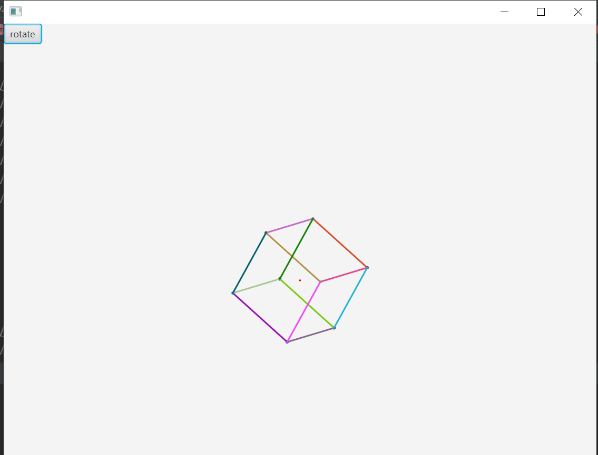

# 3D_Project
<h1>3D Project</h1>

Rotation can be done with click-and-drag mouse movements. However, there is an issue with the perspective to include depth, and distance from screen parallax (i.e. perspective of user from screen to accruately display 3d object distance rendering).

More shapes will have to be custom-made for specific rendering of the shapes' lines

